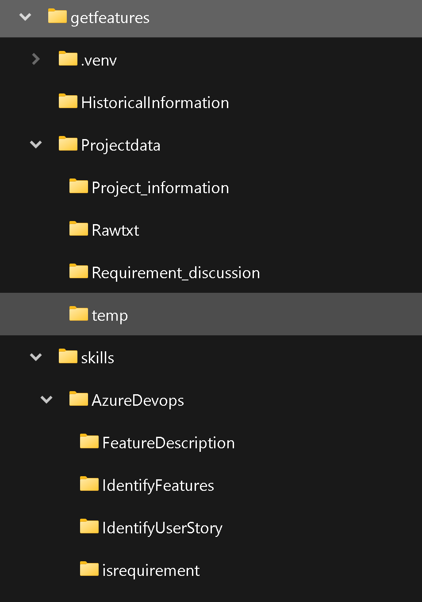

# Seamless Automation: Bridging Requirement Discussion Transcripts to Azure DevOps Features

In the fast-paced world of software development, the ability to swiftly and accurately translate client needs into tangible product features is a critical success factor. This process begins with the often-detailed discussions and conversations that help define project requirements. However, managing and extracting actionable insights from these discussions can be a time-consuming and error-prone task.

But what if you could streamline and automate this process, saving both time and resources while ensuring a higher degree of precision? Welcome to the world of end-to-end automation, where we bridge the gap from requirement discussion transcripts to Azure DevOps features.

In this blog, we'll embark on a journey through a well-structured folder system, equipped with historical data, custom skills, and project-related information. We'll explore the seamless integration of these components, guided by a comprehensive Jupyter Notebook, to automate the generation of Azure DevOps features. This isn't just about saving time; it's about transforming the way we approach requirement management.

Join us as we unravel the power of automation, unlocking efficiency, accuracy, and a whole new level of agility in the software development process. Get ready to discover how you can transition from lengthy discussions to tangible Azure DevOps features with ease. It's time to revolutionize your development pipeline and put automation at the heart of your success.

Let's embark on this exciting journey, where technology meets innovation, and automation becomes your secret weapon for software development excellence.

## Pre-requisite
- Visual studio code
Please install below extension
    - Jupyter (Publisher- Microsoft)
    - Python (Publisher- Microsoft)
    - Pylance (Publisher- Microsoft)
    - Semantic Kernel Tools (Publisher- Microsoft)
- Python
Please install below packages
    - PIP
    - semantic-kernel
- [Download](https://github.com/vivekgarudi/Semantic-Kernal-Azure/tree/main/PlugIn-for-KQLQueries-on-Log-Analytics) the content of repo

# Process flow for End to end requirement gather process using openAI and Semantic kernel

# Folder structure

The folder structure you've described seems to be organized for managing historical information, skills, and project-related data for an automated requirement generation system within Azure DevOps. Here's a detailed breakdown of the structure:

**Root** (Root folder containing all subfolders and files)
    - **HistoricalInformation** (Contains historical data of features, descriptions, and acceptance criteria for previous projects)
        - **Feature_data.csv** (A CSV storage for past information, possibly obtained from various data sources)
    - **Skills** (Folder for storing custom skills used in requirement generation)
        - **AzureDevops** (Specific skills related to Azure DevOps)
            - **FeatureDescription** (Contains semantic functions for generating feature descriptions and acceptance criteria based on predefined templates)
            - **IdentifyFeature** (Semantic function for identifying features or requirements in a given text)
            - **isRequirement** (Semantic function to check if a string contains a requirement)
            - **native_function.py** (Possibly a script or module for native functions, but marked as "Not used")
    - **Projectdata** (Folder containing data related to specific projects)
        - **Project_information** (Contains reference information used in addition to discussion transcripts for identifying requirements)
            - **Customer_objective.txt** (Contains the objectives the customer or company wants to achieve with the project)
            - **NFR.txt** (Non-functional requirements for the project, even if not discussed)
            - **project_objective.txt** (Contains the project sponsor's objectives)
        - **Rawtxt** (A folder where you place all the requirement discussion transcripts)
        - **Requirement_discussion** (A folder used by scripts to store finalized sub-transcripts that are less than 3000 characters and contain requirements)
        - **temp** (Temporary folder used for storing all transcripts generated as part of the transcript splitting process)
    - **End-to-end-requirement-genration-in-AzureDevops.ipynb** (A Jupyter Notebook that integrates and orchestrates the various components for end-to-end requirement generation in Azure DevOps)

This structure seems well-organized and suitable for a system that automates requirement generation using historical data, custom skills, and project-related information within the context of Azure DevOps.

# Information gathering
The output of this steps is all the relevent information which can directly of indirectly contribute to project success.
- Get Delivery Objectives (store the information in Root\Projectdata\Project_information\Customer_objective.txt and project_objective.txt)
- Gather Non-functional requirements (store the information in Root\Projectdata\Project_information\NFR.txt)
- Requirements elaboration session transcripts (Store the transcripts inside Root\Projectdata\Rawtxt\)
Once you have this information you can start with document processing by performing below mentined steps

# Document processing
The objective of this steps is to reduce the size of documents to limited document which actual contains requirement information.
The output of this step is te get all the sub transcripts containg requirement in Root\Projectdata\Requirement_discussion\ folder.
- Read raw discussion document from "Rawtxt" folders.
- Breaking big discussion transcript into smaller transcripts of size 3000 character.
- Put them in temp folder
- Check if subpart of the discussion contains requirement or not.
- It contains requirement put that into "Requirement_discussion" folder
- Import historical feature data in memory
Covered in steps 1 to 7

Once you have the list of document which contains requirement we can proceed further with feature identification.

# Requirement identification and refinment
The objective of this process is to identify and groom features and make them ready for importing in to Azure devops
The optput of this steps is finalized list of features and there details.
- Identify features from Proceed transcript
- remove duplicate
- Refine ,select or add new feature
- groom the selected features
- finalize feature details to be imported in Azure devops
Covered in steps 7 to 11
# Import in Azure devops
The objective of this steps is to import features in Azure devops with there respective metadata.
covered step 12 and 13

# Steps by steps process

- Step 1 - Install all python libraries
- Step 2 - Import Packages required and instantiate objects
- Step 3 - Import the **Semantic functions**:Azuredevops
- Step 4 - Splitting raw transcripts to files with <3000 char and copy them to Root\Projectdata\temp\
- Step 5 -Identify splitted files which are actually containing requirement using "isrequirement" sementic function and copy them to Root\Projectdata\Requirement_discussion\ if they do have requirement.
- Step 6 - Read all project information and set project folders.
- Step 7 - import historical data in memory for using it subsequent steps. If we are using external source such as SQL,COgnitive search, mongodb then this steps would change according to source.
- Step 8 - We pick files from Root\Projectdata\Requirement_discussion\ folder and process those using "IdentifyFeatures" semantic function.Post that we would remove dulicate requirement.
- Step 9 - We would perform manual refinment of requirement by updating details in base feature list Json "\Projectdata\Project_information\featurelist_raw.json" In this step we can update feature title ,description and select the feature which are required to implement project by changing the value of "approved" tag to "y". We can manually add feature if its been missed in list.
- Step 10 - Once you have finalized the list of feature, we groom these feature using "FeatureDescription" semantic function and historical data from memory.The outcome of this step would be, addition of multiple option of description and acceptance criteria.
- Step 11 - This is the final step befor we import these features in Azure DevOps. In this steps,wWe would perform manual refinment of requirement by updating details in feature list Json "\Projectdata\Project_information\featurelist_raw.json". In this step, we can update feature title ,description and select the Description and acceptance criteria from "descriptions" array by changing the value of "approved" tag to "y". We can manually add\update feature description if its been missed in list.

- Step 12 - Once we have finalized list of features,description ,acceptance crieria(you can inlude other parameters such as efforts business value priority etc as well). we can extecute below step to import them in Azure devops.
- Step 13 - Validate in azure devops

